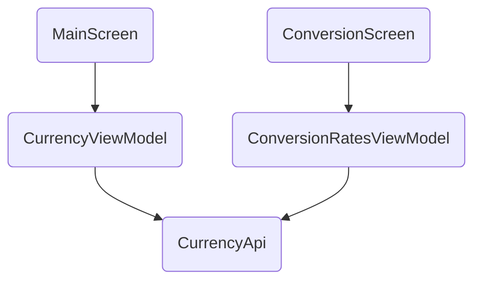

# Forex Sample

### Description
This is a currency conversion Android application implemented using [Jetpack Compose](https://developer.android.com/jetpack/compose).
To run the app you need to use the latest [Canary version of Android Studio](https://developer.android.com/studio/preview).
The application shows:
* Reusable components
* MVVM architecture
* Network Api integration
* Basic navigation
* Async processing using [Coroutines](https://kotlinlang.org/docs/coroutines-overview.html)
### Features
The application uses the [Frankfurter Api](https://www.frankfurter.app/docs) to get its display data.
The application supports the following:
* Fetch all currencies
* Get conversion rates for a given currency
### Architecture
The application uses the MVVM architecture and is structured as follows:

For the screen side, composable components are used, both the `MainScreen` and the `ConversionScreen` reusing the same list component:
```kotlin
@Composable
fun <T> ItemList(
    items: List<CurrencyInfo<T>>,
    showDetails: ((Currency) -> Unit)? = null
    ...
```
For the view model the app uses [LiveData](https://developer.android.com/topic/libraries/architecture/livedata) and [Coroutines](https://kotlinlang.org/docs/coroutines-overview.html) to handle the UI updates and process network calls asynchronously.
For the model we're using the aforementioned API as well as [Retrofit](https://square.github.io/retrofit/) to be able to do the API calls.